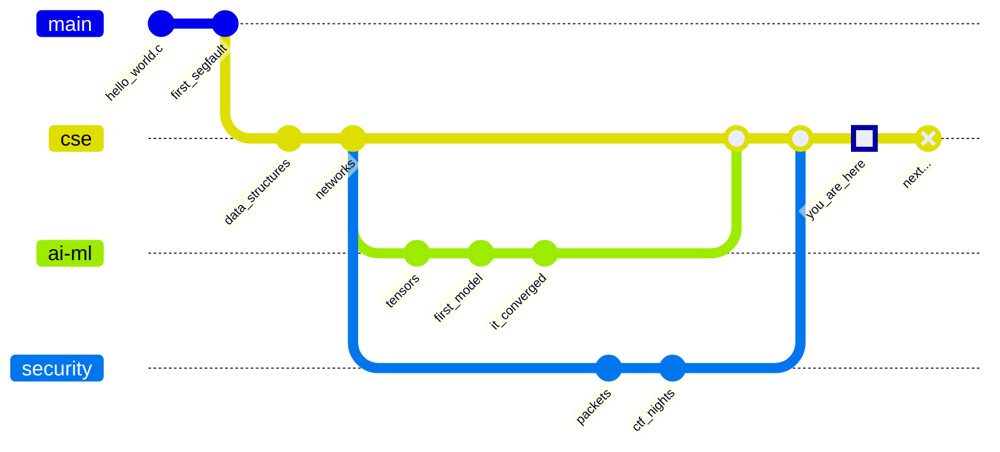
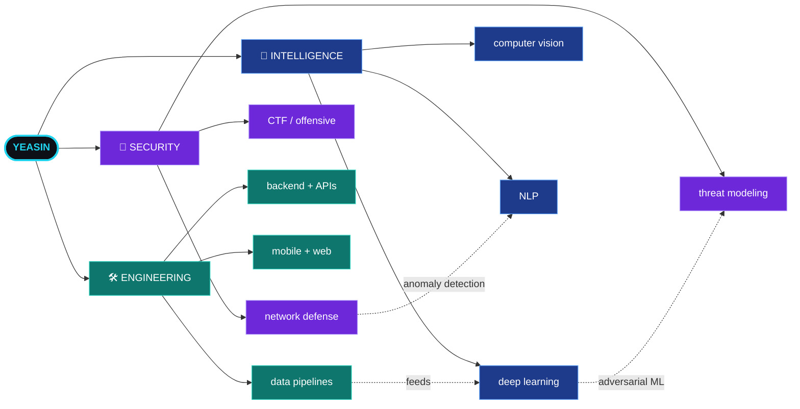

<!--
════════════════════════════════════════════════════════════════════════════
  MD YEASIN ARAFAT  ·  GITHUB PROFILE README
  Repo required: github.com/CodeWithYeasin/CodeWithYeasin  (name must match
  your username exactly, and the repo must be Public)

  Placeholders to personalise are marked with:  ✏️ EDIT
════════════════════════════════════════════════════════════════════════════
-->

<div align="center">


<a href="https://github.com/CodeWithYeasin">
  
</a>

<br/>


</div>

```console
$ ssh visitor@yeasin.dev

[ 0.000000 ]  Booting YEASIN_OS ................ final-year build
[ 0.412300 ]  loading  neural_networks.ko ...... [  OK  ]
[ 0.883141 ]  loading  threat_detection.ko ..... [  OK  ]
[ 1.302115 ]  mounting /dev/curiosity ......... [  OK  ]
[ 1.618033 ]  starting coffee_daemon :3000 .... [  OK  ]
[ 2.718281 ]  WARNING: sleep_scheduler not responding
[ 3.141592 ]  System ready. Scroll on, visitor.
```


## 🧬 CHAPTER 01 // ORIGIN

<!-- ✏️ EDIT: swap in your own real details here. Specific beats generic. -->

> Everyone remembers their first `Hello, World`. Mine ran on a secondhand laptop
> that shut itself off whenever the fan got tired, which was often.
>
> Four years of CSE later, the questions got bigger. Can a model learn to notice
> the thing I missed? Will the system still stand up when somebody is actively
> trying to knock it over?
>
> I don't have clean answers yet. I have commits.




## ⚙️ CHAPTER 02 // THE ARSENAL

Tools are boring on their own. Here's what I actually reach for, and what I reach for it *for*.

<div align="center">

**`LANGUAGES`**


**`INTELLIGENCE`**


**`SYSTEMS & WEB`**


**`DATA`**


**`SECURITY`**


</div>

<details>
<summary><b>📡 signal strength readout</b> &nbsp;<i>(click to expand)</i></summary>

<br/>

<!-- ✏️ EDIT: tune these bars so they're honest. Honest is more impressive. -->

```text
PYTHON             ██████████████████░░   models, tooling, automation
MACHINE LEARNING   ████████████████░░░░   PyTorch · TensorFlow · sklearn
C / C++            ████████████████░░░░   algorithms, systems, raw speed
BACKEND / APIs     ███████████████░░░░░   Node · Django · Flask · Nest
JAVASCRIPT / TS    ███████████████░░░░░   interfaces that feel fast
CYBERSECURITY      █████████████░░░░░░░   recon, hardening, threat modeling
DATABASES          ██████████████░░░░░░   SQL when it matters, NoSQL when it doesn't
```

</details>


## 🧠 CHAPTER 03 // THE MAP

Three domains, one brain. They overlap more than people expect. A model is just another attack surface.




## 📡 CHAPTER 04 // TELEMETRY

Numbers don't tell you whether the code was any good. They do tell you I showed up.

<div align="center">


<br/><br/>


<br/><br/>


<br/>


</div>

<!--
  🐍 CONTRIBUTION SNAKE
  Needs the workflow in .github/workflows/snake.yml (included alongside this file).
  Once the Action has run once, delete these comment markers to make it visible.

<div align="center">
  
</div>
-->


## 🚀 CHAPTER 05 // MISSIONS

Some things I built. A few of them even work the way I intended.

<!-- ✏️ EDIT: replace the rows below with your real projects. -->

| | Mission | What it does | Stack |
|:--|:--|:--|:--|
| 🧠 | **`project-one`** | One line on the problem it solves | `Python` `PyTorch` |
| 🔐 | **`project-two`** | One line on the problem it solves | `Node` `Docker` |
| ⚡ | **`project-three`** | One line on the problem it solves | `Next.js` `Postgres` |

<!--
  ✏️ EDIT: nicer version. Replace REPO-NAME with real repos, then delete these
  comment markers so the cards render.

<div align="center">
<a href="https://github.com/CodeWithYeasin/REPO-NAME">
  
</a>
<a href="https://github.com/CodeWithYeasin/REPO-NAME-2">
  
</a>
</div>
-->


## 🛰️ CHAPTER 06 // TRAJECTORY

Where this is heading.

```text
FINAL YEAR PROGRESS   ███████████████░░░░░   loading thesis...
```

- [x] Train a model that beats my own baseline
- [x] Break something on purpose, in a lab I own
- [x] Ship a full-stack app real people use
- [ ] Publish a first paper on adversarial robustness
- [ ] Land an AI or security research internship
- [ ] Open-source a security tool that isn't just for me

> [!NOTE]
> **Currently:** deep learning, threat modeling, and reading more source code than
> documentation.
> **Open to:** research collaborations, internships, and open source work.
> If you're building something at the intersection of AI and security, message me.


## 📬 CHAPTER 07 // TRANSMISSION

My inbox is open. So is my calendar, mostly.

<div align="center">

[](https://www.linkedin.com/in/md-yeasin-arafat-b23484343)
[](mailto:codewithyeasin@gmail.com)
[](https://x.com/CodeWithYeasin)
[](https://medium.com/@codewithyeasin)

[](https://www.youtube.com/channel/UCW6pRWGsCDE51qBhliPn4Ow)
[](https://www.behance.net/codewitarafat)
[](https://www.facebook.com/ya.yeasin.50)
[](https://www.instagram.com/im.arafat_yeasin/)

</div>

<br/>

<details>
<summary><b>🔓 you found the terminal</b></summary>

<br/>

```console
$ cat /var/log/yeasin/truths.log

01:14  the bug was in the code I was most confident about
02:47  "it works on my machine" is a threat model, not a defense
03:30  a model with 99% accuracy on a broken dataset is 100% wrong
04:02  documentation is a love letter to your future self
04:58  go to sleep. the compiler will still be there.
```

<div align="center">
  
  <br/>
  
</div>

</details>

<div align="center">

<br/>

`if you scrolled this far, you're my kind of person. star something on the way out. ⭐`


</div>
