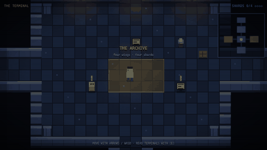
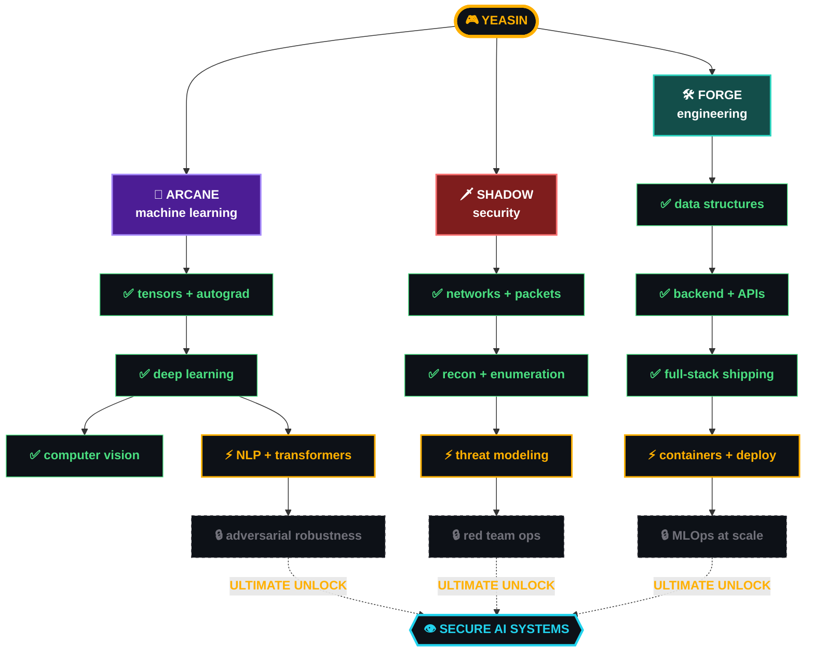

<!--
  YEASIN.EXE · an RPG-style GitHub profile
  Repo: github.com/CodeWithYeasin/CodeWithYeasin  (public, name must equal username)

  "EDIT" markers show where to put your real details.
  Any block between START_SECTION and END_SECTION comments is rewritten by
  .github/workflows/profile-stats.yml — do not hand-edit inside those.
-->

<div align="center">


<br/>

<!-- ═══════════════ HUD ═══════════════ -->
<!--START_SECTION:hud-->


<!--END_SECTION:hud-->


</div>

<div align="center">

<!--START_SECTION:save-->

<!--END_SECTION:save-->

<!--START_SECTION:xp-->
```text
   HP  ████████████████░░░░░░░░░   62/100   sleep_scheduler still unpatched
   MP  ██████████████████░░░░░░░   73/100   7 languages in the spellbook
   XP  ░░░░░░░░░░░░░░░░░░░░░░░░░  LV 4 → 5   ·   8 / 1,200 XP

   commits 96   ·   PRs 4   ·   issues 0   ·   reviews 0
   repos 10   ·   stars 1   ·   forks 0   ·   party 1
   best streak 3d   ·   last 30 days 14 contributions

   ▸ autosaved 18 Aug 2026 · 07:43 UTC
```
<!--END_SECTION:xp-->

</div>


<div align="center">

## ▶ `THIS PROFILE IS A GAME. GO PLAY IT.`

**A real pixel RPG in your browser.** Walk around with the arrow keys, read the terminals,
collect four data shards, open the north gate. Everything you learn in there is true.

<a href="https://codewithyeasin.github.io/CodeWithYeasin/game/">
  
</a>

<a href="https://codewithyeasin.github.io/CodeWithYeasin/game/">

</a>

`↑ ↓ ← →` or `WASD` to move &nbsp;·&nbsp; `E` to talk &nbsp;·&nbsp; works on phones too

</div>


## 🎮 `ACT I` — CHARACTER CREATION

> The tutorial level was a `Hello, World` on a laptop that shut itself off whenever
> the fan got tired. Which was often. I kept restarting it. That's basically the
> whole game right there.
>
> Four years into the CSE campaign, the quests got harder and the questions got
> better. **Can a model learn to notice the thing I missed? Will the system still
> stand when someone is actively trying to knock it over?**
>
> No clean answers yet. Just a commit history and a stubborn streak.

<!-- ✏️ EDIT: make this your actual origin story. Specific beats generic, always. -->

<div align="center">

### `⚔️  BASE STATS  ⚔️`

</div>

| STAT | | VALUE | WHAT IT MEANS IN PRACTICE |
|:--|:--|:--|:--|
| 🧠 **INT** | `████████████████░░░░` | **16** | Models, math, and reading papers I only half understand at first |
| 🗡️ **DEX** | `███████████████░░░░░` | **15** | Shipping fast without breaking the build. Mostly. |
| 🛡️ **CON** | `██████████████████░░` | **18** | Debugging stamina. I will outlast the bug. |
| 🔮 **WIS** | `█████████████░░░░░░░` | **13** | Knowing which problem *not* to solve today |
| 🎭 **CHA** | `██████████████░░░░░░` | **14** | Explaining a neural net to someone who did not ask |
| 🍀 **LCK** | `███████░░░░░░░░░░░░░` | **07** | The demo works right up until someone important walks in |


## 🌳 `ACT II` — THE SKILL TREE

Three branches, one mana pool. They overlap more than the course catalogue admits —
**a model is just another attack surface.**



<div align="center">

`✅ mastered` &nbsp;·&nbsp; `⚡ training now` &nbsp;·&nbsp; `🔒 locked — needs more XP`

</div>


## 🎒 `ACT III` — INVENTORY

Loot collected across the campaign. Rarity is honest, not flattering.

<details open>
<summary><b>&nbsp;🔮 ARCANE SLOT</b> &nbsp;<code>legendary</code></summary>

<div align="center">


</div>

```text
🔮 STAFF OF BACKPROPAGATION            +16 INT   "it converged at 3am and I cried"
📜 SCROLL OF ATTENTION                 +12 INT   consumed on read, permanently
🧪 FLASK OF OVERFITTING (cursed)       -09 WIS   99% train, 61% test. never again.
```

</details>

<details>
<summary><b>&nbsp;🗡️ SHADOW SLOT</b> &nbsp;<code>epic</code></summary>

<div align="center">


</div>

```text
🗡️ DAGGER OF ENUMERATION              +14 DEX   finds the door nobody locked
🕯️ LANTERN OF PACKET CAPTURE          +11 WIS   the traffic was lying the whole time
🛡️ WARD OF LEAST PRIVILEGE            +18 CON   boring, unglamorous, saves the run
```

</details>

<details>
<summary><b>&nbsp;🛠️ FORGE SLOT</b> &nbsp;<code>rare</code></summary>

<div align="center">


</div>

```text
🔨 HAMMER OF SEGFAULT (C, C++)         +15 CON   taught me what memory actually is
⚙️ ENGINE OF CONTINUOUS DELIVERY       +13 DEX   green pipeline, quiet mind
📦 BAG OF HOLDING (Docker)             +∞  SAN   "works on my machine" → deprecated
```

</details>


## 📜 `ACT IV` — QUEST LOG

<!-- ✏️ EDIT: replace these with your real repos. Link them. The links are the point. -->

### `⭐ MAIN QUESTS`

| | QUEST | OBJECTIVE | REWARD | STATUS |
|:--|:--|:--|:--|:--|
| 🔮 | **[`project-one`](https://github.com/CodeWithYeasin)** | One line on the problem it kills | `Python` `PyTorch` | ✅ CLEARED |
| 🗡️ | **[`project-two`](https://github.com/CodeWithYeasin)** | One line on the problem it kills | `Node` `Docker` | ✅ CLEARED |
| ⚙️ | **[`project-three`](https://github.com/CodeWithYeasin)** | One line on the problem it kills | `Next.js` `Postgres` | ⚡ IN PROGRESS |
| 🎓 | **`FINAL YEAR THESIS`** | Prove the thing, then defend the thing | `+2000 XP` | ⚡ IN PROGRESS |

<!--
  Optional: GitHub's own pinned-repo cards render as images from a third-party
  service that rate-limits hard. If you want repo cards here, prefer linking the
  repos directly in the table above — a dead link never happens, a dead image does.
-->

### `🌙 SIDE QUESTS`

- [x] Train a model that beats my own baseline — *reward: `+300 XP`, mild smugness*
- [x] Break something on purpose, in a lab I own — *reward: `+250 XP`, healthy paranoia*
- [x] Ship a full-stack app that real people actually use — *reward: `+400 XP`, real bug reports*
- [ ] Publish a first paper on adversarial robustness — *reward: `+1500 XP`, `TITLE: Author`*
- [ ] Land an AI or security research internship — *reward: `+1200 XP`, new region unlocked*
- [ ] Open-source a security tool that isn't just for me — *reward: `+800 XP`, `TITLE: Maintainer`*


## 🐉 `ACT V` — BOSS FIGHTS

Every one of these took more attempts than I'd like on record.

```text
╭─ 🐉 THE VANISHING GRADIENT ────────────────────────────── DEFEATED ─╮
│  HP  ░░░░░░░░░░░░░░░░░░░░  0 / 9999                                │
│  weakness: residual connections, patience, a smaller learning rate │
╰────────────────────────────────────────────────────────────────────╯

╭─ 👹 CORS: THE ETERNAL ─────────────────────────────────── DEFEATED ─╮
│  HP  ░░░░░░░░░░░░░░░░░░░░  0 / 7777                                │
│  weakness: reading the error message all the way to the end        │
╰────────────────────────────────────────────────────────────────────╯

╭─ 💀 SEGMENTATION FAULT (core dumped) ──────────────────── DEFEATED ─╮
│  HP  ░░░░░░░░░░░░░░░░░░░░  0 / 8888                                │
│  weakness: valgrind, humility, one print statement at a time       │
╰────────────────────────────────────────────────────────────────────╯

╭─ ⚔️ THE THESIS ───────────────────────────────── FIGHT IN PROGRESS ─╮
│  HP  ████████████░░░░░░░░  6100 / 10000                            │
│  phase 2 of 3 · it has a second health bar · of course it does     │
╰────────────────────────────────────────────────────────────────────╯

╭─ 🔒 ??? ─────────────────────────────────────────────────── LOCKED ─╮
│  requires: LV 30 · "publish something someone else cites"          │
╰────────────────────────────────────────────────────────────────────╯
```


## 🏆 `ACT VI` — ACHIEVEMENTS

Unlocked the hard way. Rarity is honest, not flattering.

| | ACHIEVEMENT | HOW IT UNLOCKED | RARITY |
|:--:|:--|:--|:--:|
| 🌙 | **Night Owl** | Commit pushed between 02:00 and 05:00 | `common` |
| 🔥 | **It Compiled First Try** | Happened once. Nobody was there to see it. | `mythic` |
| 🧠 | **Loss Went Down** | And stayed down, on the validation set too | `rare` |
| 🐛 | **The Bug Was Me** | It was always the code I was most confident in | `common` |
| 🔐 | **Root Cause Found** | Not the symptom. The actual cause. | `epic` |
| 📚 | **Read The Source** | Docs were wrong. Source was not. | `rare` |
| ☕ | **Sustained By Tea** | 1000+ cups logged, 0 regrets recorded | `common` |
| 💀 | **Force Pushed To Main** | We do not speak of this achievement | `cursed` |


## 📊 `ACT VII` — SCOREBOARD

Numbers don't prove the code was good. They do prove I kept showing up.
These cards are drawn from my own data by the workflow in this repo — no
third-party stats service to rate-limit me into a broken image.

<div align="center">

<!--START_SECTION:cards-->


<!--END_SECTION:cards-->

</div>

<!--
  🐍 THE GRIND — contribution snake. Needs .github/workflows/snake.yml to run
  once, then delete these two comment lines.

<div align="center">
  
</div>
-->


## 🕹️ `ACT VIII` — SIDE QUEST: THE 3AM INCIDENT

The browser RPG up top is the main campaign. This is the side quest: a text
adventure that runs **entirely inside GitHub Issues**. Open an issue, pick a letter,
and a bot renders the next scene until you hit one of six endings. Two lives.

<div align="center">

### `▶  START A NEW RUN`

<a href="https://github.com/CodeWithYeasin/CodeWithYeasin/issues/new?template=play.yml&title=%F0%9F%8E%AE+New+run">

</a>
&nbsp;
<a href="https://github.com/CodeWithYeasin/CodeWithYeasin/issues?q=is%3Aissue+label%3Aadventure">

</a>

</div>

```text
   THE ENTRANCE
   ─────────────────────────────────────────────────────────────
   A server room, 3AM. One rack is humming at the wrong pitch.
   The logs stopped writing forty minutes ago.

     [A]  Tail the logs anyway. Something's still there.
     [B]  Pull the rack's network cable. Contain first, ask later.
     [C]  Open the model dashboard. Check what it's been predicting.

   ▸ pick a letter in the issue form and the bot takes it from there
```


## 📡 `ACT IX` — PARTY INVITE

Recruiting for research collabs, internships, and open source raids.
If you're building at the intersection of **AI and security**, ping me.

<div align="center">

[](https://www.linkedin.com/in/md-yeasin-arafat-b23484343)
[](mailto:codewithyeasin@gmail.com)
[](https://x.com/CodeWithYeasin)
[](https://medium.com/@codewithyeasin)

[](https://www.youtube.com/channel/UCW6pRWGsCDE51qBhliPn4Ow)
[](https://www.behance.net/codewitarafat)
[](https://www.facebook.com/ya.yeasin.50)
[](https://www.instagram.com/im.arafat_yeasin/)

</div>

<br/>

<details>
<summary><b>&nbsp;🔓 SECRET AREA — you found the dev console</b></summary>

<br/>

```console
$ cat /var/log/yeasin/lore.log

01:14  the bug was in the code I was most confident about
02:47  "it works on my machine" is a threat model, not a defense
03:30  a model with 99% accuracy on a broken dataset is 100% wrong
04:02  documentation is a love letter to your future self
04:58  go to sleep. the compiler will still be there tomorrow.

$ ./unlock --achievement "curious"
  ✔ +50 XP awarded. you actually clicked it.
```

<div align="center">
  
  <br/>
  
</div>

</details>

<div align="center">

<br/>

`▸ YOU SCROLLED TO THE END. THAT'S RARE. STAR A REPO ON THE WAY OUT ⭐`


</div>
